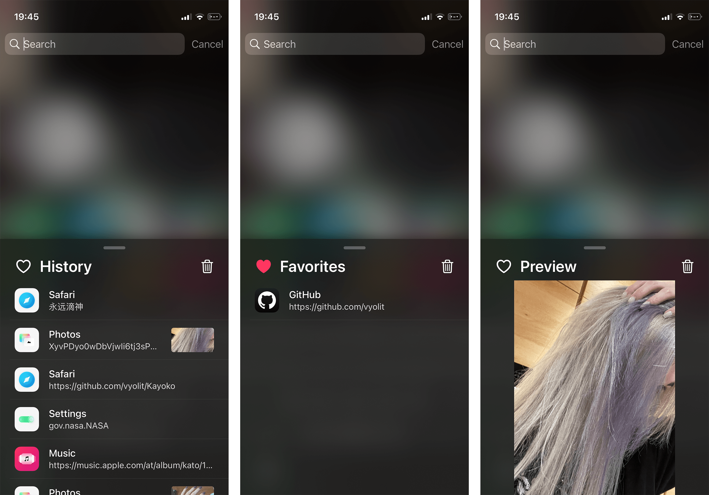

# Kayoko
Feature rich clipboard manager for iOS

## Preview

## Installation
1. Download the latest `deb` from the [releases](https://github.com/Traurige/Kayoko/releases)
2. Install Kayoko

## Compatibility
iPhone, iPad and iPod running iOS/iPadOS 13 or later

## Compiling
  - [Theos](https://theos.dev/) is required to compile the project
  - You may want to edit the root `Makefile` to use your Theos SDK and toolchain

## License
[GPLv3](https://github.com/Traurige/Kayoko/blob/main/COPYING)
